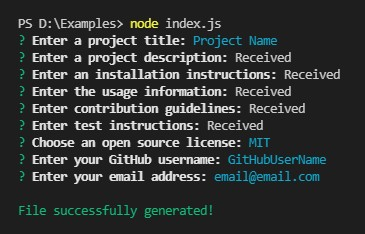

# Readme File Generator

## Description
A command-line application that prompts user for information about application repository and then generates a professional [README.md](./dest/README.md) with the title of my project and sections entitled Description, Table of Contents, Installation, Usage, License, Contributing, Tests, and Questions.

## Installation
To be able to use the script to generate [README.md](./dest/README.md) file, you need to install the necessary `npm modules`. You can do this by running the command 

```bash
npm install
```

in the root folder of the project.

## Usage
To run script for generation [README.md](./dest/README.md) file use this command

```bash
node index.js
```

After running the script, you will need to answer a few questions to complete the file:




Watch a [Video Guide](https://drive.google.com/file/d/1PshutEnoIHTEriDyE_EYxUJwV1EbVQCv/view?usp=sharing) for more details.

## Credits

Author [Oleksandr Kulyk](https://github.com/AlexKuWerz)

Packages used:
- [Inquirer](https://www.npmjs.com/package/inquirer)
